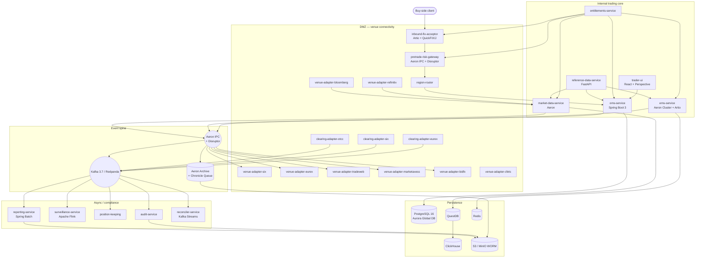

# C4 Level 2 — Containers

See `tools/architecture/workspace.dsl` for the canonical Structurizr DSL.

```mermaid
flowchart TB
  subgraph DMZ[DMZ — venue connectivity]
    InboundFix[inbound-fix-acceptor<br/>Artio + QuickFIX/J]
    PretradeRisk[pretrade-risk-gateway<br/>Aeron IPC + Disruptor]
    RegionRouter[region-router]
    VAS[venue-adapter-six]
    VAE[venue-adapter-eurex]
    VAB[venue-adapter-bloomberg]
    VAR[venue-adapter-refinitiv]
    VAT[venue-adapter-tradeweb]
    VAM[venue-adapter-marketaxess]
    VAX[venue-adapter-bidfx]
    VAC[venue-adapter-cfets]
    CLA[clearing-adapter-eurex]
    CLS[clearing-adapter-six]
    CLO[clearing-adapter-otcc]
  end

  subgraph Internal[Internal trading core]
    OMS[oms-service<br/>Spring Boot 3]
    EMS[ems-service<br/>Aeron Cluster + Artio]
    MD[market-data-service<br/>Aeron]
    REF[reference-data-service<br/>FastAPI]
    ENT[entitlements-service]
    UI[trader-ui<br/>React + Perspective]
  end

  subgraph Async[Async / compliance]
    REP[reporting-service<br/>Spring Batch]
    SUR[surveillance-service<br/>Apache Flink]
    BO[position-keeping]
    AUD[audit-service]
    REC[reconciler-service<br/>Kafka Streams]
  end

  subgraph Spine[Event spine]
    AERON((Aeron IPC<br/>+ Disruptor))
    KAFKA((Kafka 3.7 / Redpanda))
    ARCHIVE[(Aeron Archive<br/>+ Chronicle Queue)]
  end

  subgraph Storage[Persistence]
    PG[(PostgreSQL 16<br/>Aurora Global DB)]
    QDB[(QuestDB)]
    CH[(ClickHouse)]
    REDIS[(Redis)]
    S3[(S3 / MinIO WORM)]
  end

  Client([Buy-side client]) --> InboundFix
  InboundFix --> PretradeRisk
  PretradeRisk --> RegionRouter
  RegionRouter --> OMS
  UI --> OMS
  OMS --> AERON
  EMS --> AERON
  AERON --> VAS & VAE & VAT & VAM & VAX
  VAR --> MD
  VAB --> MD
  MD --> AERON
  AERON --> ARCHIVE
  AERON --> KAFKA
  KAFKA --> SUR & REP & BO & AUD & REC
  CLA --> KAFKA
  CLS --> KAFKA
  CLO --> KAFKA
  OMS --> PG
  MD --> QDB
  QDB --> CH
  EMS --> REDIS
  ARCHIVE --> S3
  AUD --> S3
  REP --> S3
  ENT --> OMS & EMS & MD & InboundFix & PretradeRisk
  REF --> OMS & EMS & MD
```
